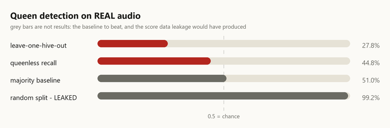

# Real data: what we fetched, what we trained, what failed

Everything in [06-ml.md](06-ml.md) was measured on simulated hives. This
document covers the work done on **real, licensed** datasets — which datasets,
under what terms, and what the models actually scored.

Two of the three results are negative. They are here because a results folder
that only records what worked is advertising.

---

## 1. Licensing is enforced in code, not promised in prose

`ml/datasets/registry.json` declares every dataset with a licence, a resolvable
DOI and an attribution string. `ml/fetch_datasets.py` **refuses to download an
entry missing any of those** before a byte moves. Each dataset directory gets a
`LICENSE.txt` and a `PROVENANCE.json` written beside the files, so a copy that
escapes this repo still says where it came from and what may be done with it.

```bash
python ml/fetch_datasets.py --list     # licences and sizes, plus what we rejected
python ml/fetch_datasets.py --all      # ~5.2 GB, MD5-verified, resumable
```

Datasets are never committed. The registry that says *which* datasets is.

### What we used

| Dataset | Licence | Size | Used for |
|---|---|---|---|
| **To bee or not to bee** (Nolasco & Benetos 2018) | CC BY 4.0 | 3.7 GB | Queen presence from real audio |
| **VarroaDataset** (Schurischuster & Kampel 2020) | CC BY 4.0 | 1.2 GB | Varroa on real bee images |
| **MSPB** (Quebec, 53 colonies) | **CC BY-NC 4.0** | 0.4 GB | Colony-level varroa and honey yield |

**MSPB is non-commercial.** Nothing trained on it may ship in a commercial
deployment without the authors' permission. It is flagged
`commercial_use: false` in the registry, the fetcher prints the restriction, and
the licence file repeats it.

### What we rejected, and why that matters more

| Rejected | Reason |
|---|---|
| **Weight/Temperature/Humidity of German colonies** — 78 colonies, 3 years, scale plus five in-hive sensors | **No licence declared** on the Zenodo record. This is the best real hive-weight source we found and exactly what the yield forecaster needs. Open access is not a licence to use. |
| **BeeAlarmed/BeeDataset** | GPL-3.0 applied to a dataset. Its copyleft obligations on "derived works" are legally unclear when the derived work is a trained model, and we will not put a model of uncertain provenance behind an on-chain gate. |
| **Kaggle sets** (Smart Bee Colony Monitor, BeeTogether, BeeImage) | Need an authenticated API token this environment lacks, and per-dataset licences vary and must be checked individually rather than assumed from the platform. Deferred, not dismissed. |

The German dataset hurts to lose. It is recorded with its reason so nobody
re-evaluates it in three weeks and reaches the same dead end.

---

## 2. Varroa on real bee images — **works**

`ml/train_varroa_cnn.py` → `metrics/varroa_entrance_cnn.json`

A 4-block CNN, ~0.3M parameters, trained on CPU over 8,225 images.

| | |
|---|---|
| Test accuracy | **0.893** |
| Test AUC | **0.921** |
| Infested recall | 0.685 |
| Infested precision | 0.903 |
| Test set | 3,408 images from **2 unseen recording sessions** |

**How to read the 0.685 recall.** It is per *bee*, and the decision that matters
is per *colony*. An entrance camera sees hundreds of bees; at this recall and
precision the colony-level infestation estimate is far tighter than the per-bee
figure suggests. Quoting only the per-bee recall understates it — and quoting a
colony-level number we did not measure would be inventing one.

### Two things the dataset's own README does not say

**There are two positive label ids.** `gt.csv` uses `1` (3,083 rows) and `3`
(864 rows); the README documents only `0` and `1`. Both carry mite bounding
boxes. Merging them reproduces the published 3,947 infested / 9,562 healthy
**exactly**, which is what confirms the reading. The obvious code —
`label == 1` — silently discards **22% of the positives**.

**`bee_id` is reused across sessions.** It looks like 2,115 bees appear in both
train and test. They do not: ids are unique only within a session, and the
sessions are disjoint. We checked before training rather than after.

### What it is not

This is an **entrance-camera** model. It does not replace the sticky-board
counter in `apps/api/aurabee_api/varroa.py`, which answers a different question
with a different sensor. Presenting 0.893 as an improvement on that counter's
12.5% error would be comparing unlike things.

---

## 3. Queen detection on real audio — **fails, and is not shipped**

`ml/train_acoustic.py` → `metrics/acoustic_queen.json`



| | |
|---|---|
| Leave-one-hive-out accuracy | **0.278** |
| Majority baseline | **0.510** |
| Random-split accuracy | **0.992** |
| Leakage gap | **+0.714** |

### Why the honest number is so much lower

Queen state in this corpus is perfectly confounded with hive, session,
microphone and background noise: every recording session is entirely queenright
or entirely queenless. A random split of 3-second windows lets the model
memorise room tone, which is what produces 0.992.

Worse, only **two of the four hives** ever appear in both states:

| Hive | Queenright | Queenless | |
|---|---|---|---|
| Hive1 (NU-Hive) | 12 files | 5 files | testable |
| Hive3 (NU-Hive) | 2 files | 16 files | testable |
| CF003 (OSBH) | 14 files | — | **train only** |
| CJ001 (OSBH) | — | 5 files | **train only** |

CF003 and CJ001 are single-class, so hive identity predicts the label perfectly;
a fold testing on either measures hive recognition, not queen detection. That
leaves a two-fold test.

### Why below chance is *not* evidence of an inverted signal

The model's predictions track the **training prior** and ignore the held-out
colony entirely:

| Held out | Train prior P(queenright) | Model predicts | Truth |
|---|---|---|---|
| Hive1 | 0.351 | **0.008** | 0.718 |
| Hive3 | 0.749 | **0.661** | 0.087 |

It learned nothing transferable and fell back to the prior; each held-out hive's
class balance happens to be inverted relative to that prior, which is the whole
explanation for sub-50%.

Feature choice does not rescue it — dropping absolute MFCC means gives 0.274,
normalised spectral shape only 0.273, per-hive cepstral mean subtraction 0.315.
All far below 0.510.

**So we do not ship it.** `train_acoustic.py` compares against the majority
baseline and refuses to mark a model deployable when it loses. The deployed
queenless detector remains the simulator-trained telemetry classifier, labelled
as such. Real-audio queen detection needs recordings from many hives in **both**
states, which is a stated goal of the pilot in [14-roadmap.md](14-roadmap.md).

---

## 4. Colony-level check on real hives — **no signal**

`ml/train_mspb.py` → `metrics/mspb_colony.json`

53 real colonies, one year, 16 audio band energies plus temperature and
humidity, against hand-counted varroa and weighed honey.

| Target | n | model MAE | baseline MAE | R² | verdict |
|---|---|---|---|---|---|
| varroa / 100 bees | 53 | 0.670 | 0.626 | −0.317 | no better than the mean |
| honey (kg) | 46 | 14.78 | 13.30 | −0.296 | no better than the mean |

The unit is the **colony** (n=53), not the sensor row (~1.9M), because rows from
one colony are repeated measurements of the same thing. Evaluation is
leave-one-colony-out against a predict-the-mean baseline.

### What this does and does not say

It does **not** say hive sensors cannot predict yield. It says the crudest
defensible summarisation — one season-average per colony per sensor — throws
away the trajectory, and trajectory is where our own models find their signal
(`ml/features.py` uses rolling windows precisely because faults are
trajectories, not instants). A time-resolved model is the obvious next step.

We did not keep tuning. With n=53 and a leave-one-out score, iterating on
features until the number turns positive is fitting the evaluation rather than
the problem.

### The bug worth recording

The first run reported honey **R² = +0.136, "beats baseline"** — a plausible,
publishable-looking result that was entirely an artefact.

It joined on `beehub_name`, which looks like a hive id and is actually the
**apiary**: two values for 53 colonies. Every colony received one of two feature
vectors, so the model was learning an apiary mean. The correct key is
`tag_number − 200000`, which reproduces all 53 colony numbers in the workbook's
own lookup table. With the join fixed, honey R² moved to **−0.296**.

It surfaced only because the log printed *"2 colonies in the sensor stream"*
beside *"53 colonies join on both sides"* — two numbers that cannot both be
true. There is now a guard that refuses to report any score when distinct
feature vectors fall below half the colony count.

---

## 5. What this changes about the project's claims

- The varroa story improves and gains a **second, real modality**: an entrance
  camera detects mites on bees at 0.89 accuracy on unseen sessions.
- The queen-detection story does **not** improve. The public data cannot support
  it, and we now have the measurement that says so rather than an assumption.
- The yield story is **unchanged and still the weakest link**. The P90 that
  becomes an on-chain mint ceiling has never been fitted against a real harvest,
  the one dataset that could have helped is unlicensed, and season-average
  features on the dataset we could use carry no signal.

The remaining gap is unchanged and now better evidenced: every real dataset
available is *Apis mellifera* in Europe or Canada. *Apis cerana indica* has no
public dataset at all.
