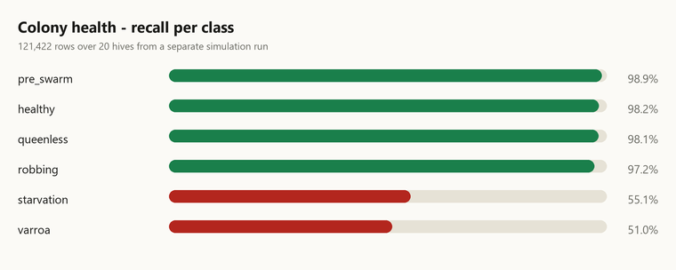
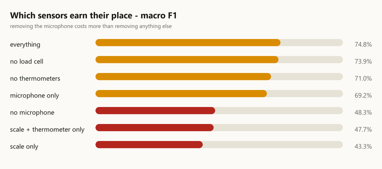
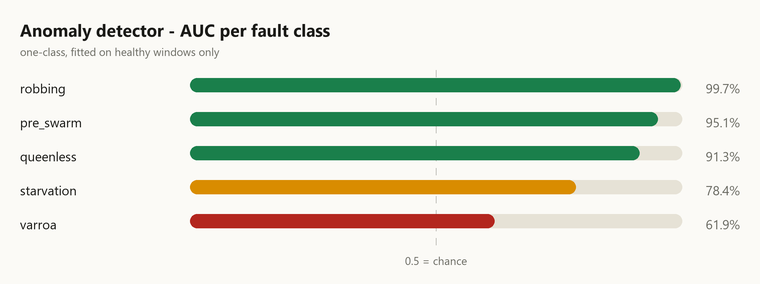

# Model results

Generated 2026-09-08T14:53:11Z by `scripts/export_metrics.py`.
Every number is read from the artefact that produced it — nothing here
is retyped, so this cannot drift from the models actually loaded.

---

## Summary

| Model | Version | Headline | Weakest point |
|---|---|---|---|
| Colony health | `health-hgb-0.1.0` | 97.4% accuracy, queenless recall 0.981 | varroa recall 0.510 |
| Yield forecaster | `yield-gbq-0.1.0` | P90 covers 100.0% after calibration | +45% mean headroom — a generous ceiling |
| Anomaly detector | `anomaly-iforest-0.1.0` | robbing AUC 0.997, 1.0% false alarms | varroa AUC 0.619 |
| Varroa counter | `varroa-cv-0.1.0` | 12.5% mean error on synthetic boards | no real-board data to measure against |

---

## Colony health classifier

- **97.4%** accuracy on 121,422 rows from **20 hives in a separate simulation run** (different seed, different weather).
- Split by hive, never by row: consecutive hourly frames from one colony are near-duplicates, and a random row split produces a fake 99% that collapses on a new hive.

| Class | Recall |
|---|---|
| pre_swarm | 0.989 |
| healthy | 0.982 |
| queenless | 0.981 |
| robbing | 0.972 |
| starvation | 0.551 |
| varroa | 0.510 |
| wax_moth | 0.000 *(no test examples)* |

Accuracy is the least useful number here — the set is ~70% healthy, so always predicting "healthy" scores 0.70. Recall per class is what matters, and **varroa is the weak one**: it is a three-week decline that looks like "slightly less healthy". The alerting layer therefore requires 0.88 confidence before varroa may interrupt a beekeeper.

---

## Sensor ablation

| Sensor set | macro F1 | accuracy | queenless | pre_swarm | varroa |
|---|---|---|---|---|---|
| everything | **0.748** | 0.975 | 0.983 | 0.990 | 0.531 |
| no load cell | **0.739** | 0.955 | 0.905 | 0.988 | 0.620 |
| no thermometers | **0.710** | 0.970 | 0.987 | 0.990 | 0.247 |
| microphone only | **0.693** | 0.935 | 0.925 | 0.990 | 0.013 |
| no microphone | **0.483** | 0.929 | 0.979 | 0.365 | 0.223 |
| scale + thermometer only | **0.477** | 0.927 | 0.978 | 0.326 | 0.223 |
| scale only | **0.433** | 0.909 | 0.948 | 0.426 | 0.118 |

Removing the microphone costs 0.265 macro F1 and 0.624 of pre_swarm recall (0.990 -> 0.365) -- swarm prediction is almost entirely acoustic. The best single-sensor configuration is 'microphone only' at 0.693; the worst is 'scale only' at 0.433. Permutation importance ranked mass features on top and was misleading, because the 33 acoustic features are correlated and permuting one at a time barely moves the score. Ablation by sensor GROUP is the honest measurement.

---

## Yield forecaster

- P90 coverage **100.0%** after conformal calibration (×1.0332), from 91.5% before.
- Trained on 397 hive-windows, tested on 59.

The P90 becomes the **on-chain mint ceiling**, so this is the one model whose error costs a real person money. The two errors are not symmetric: a ceiling that is too low blocks an honest beekeeper from selling their own honey and ends adoption, while one that is too high lets some fraud through to the chemical testing ladder. The ceiling is deliberately generous.

The first fit covered only 74.6% of actual yields — a quarter of honest beekeepers would have been blocked. Conformal calibration on hives the model had never seen fixed it, but only after training across four independent weather realisations: the first calibration attempt returned a factor of exactly 1.000 and did nothing, because the calibration hives shared a weather seed with the fit hives while the test run did not. Conformal guarantees require exchangeability, and a weather shift breaks it.

---

## Anomaly detector

Fitted on healthy windows only, so it answers *"unlike anything normal"* rather than naming a known fault — which is what catches faults the classifier has no class for.

| Fault | AUC |
|---|---|
| robbing | 0.997 — strong |
| pre_swarm | 0.951 — strong |
| queenless | 0.913 — strong |
| starvation | 0.784 — useful |
| varroa | 0.619 — weak |

False alarm rate 1.0% at a threshold set from the *healthy* distribution — not tuned against known faults, because in the field there is no label to tune against and a threshold fitted to known faults would not survive an unknown one.

---

## Varroa counter

- Method: classical CV: adaptive threshold + size/shape/solidity filters
- Mean relative error: **12.5%** against synthetic boards with known counts

| Case | True | Found | Error |
|---|---|---|---|
| clean board, no mites | 0 | 0 | +0 |
| light infestation | 8 | 6 | -2 |
| moderate | 25 | 23 | -2 |
| heavy | 60 | 50 | -10 |
| heavy + lots of debris | 60 | 54 | -6 |
| low resolution photo | 25 | 30 | +5 |
| high resolution photo | 25 | 23 | -2 |
| mildly blurred | — | refused | The photo is out of focus. Hold the phone steady, ab |
| very blurred | — | refused | The photo is out of focus. Hold the phone steady, ab |

Measured against SYNTHETIC boards with known counts. This validates the algorithm's mechanics and serves as a regression test; it is NOT field accuracy. There is no annotated Indian sticky-board dataset to measure that against yet.

---

## Models trained on REAL, licensed data

Kept separate from everything above, which is simulator-trained. Dataset licences and the sources we rejected are in [`ml/datasets/registry.json`](../ml/datasets/registry.json).

### Varroa on real bee images — `varroa-entrance-cnn-0.1.0`

- **89.3%** accuracy, **AUC 0.921** on 3,408 held-out images from 2 unseen recording sessions.
- Infested recall 0.685, precision 0.903.
- Data: VarroaDataset (Schurischuster & Kampel 2020), CC BY 4.0

gt.csv uses TWO positive ids, 1 (3,083) and 3 (864); the dataset README documents only 0 and 1. Merging them reproduces the published 3,947 infected / 9,562 healthy exactly. Training on `label == 1` alone would discard 22% of the positives.

REAL images, Apis mellifera, controlled lighting at a hive entrance in Europe. This is an ENTRANCE-CAMERA model and does NOT replace the sticky-board counter in apps/api/aurabee_api/varroa.py -- different sensor, different question. It has never seen an Indian apiary or a phone photo.

### Queen detection on real audio — **NOT SHIPPED**

- Leave-one-hive-out accuracy **0.278** against a **0.510** majority baseline.
- A random split of the same windows scores **0.992** — a leakage gap of **+0.714**.
- Data: To bee or not to bee (Nolasco & Benetos 2018), CC BY 4.0

Cross-hive queen detection FAILS on this corpus. Every feature variant scores 0.27-0.32 against a 0.51 majority baseline, while a random split of 3-second windows scores 0.992. The gap is the recording session, not the bees.

Not because the signal is inverted. The model's predictions track the TRAINING PRIOR and ignore the held-out colony: holding out Hive1 the train prior is P(queenright)=0.351 and the model predicts 0.008 against a true 0.718; holding out Hive3 the prior is 0.749 and it predicts 0.661 against a true 0.087. It learned nothing that transfers and fell back to the prior, and each held-out hive's class balance happens to be inverted relative to that prior. Sub-50% is an artifact of that, not evidence of an inverted cue.

We do not ship a model that loses to a coin flip. The deployed queenless detector remains the telemetry classifier in ml/train_health.py, which is simulator-trained and labelled as such. Real-audio queen detection needs recordings from multiple hives in BOTH states -- this corpus has only two such hives, and collecting that data is a stated goal of the pilot.

### Colony-level check on real hives (MSPB)

- 53 colonies, 44 features. **NON-COMMERCIAL. Research use only. Nothing trained on MSPB may ship in a commercial deployment without the authors' permission.**

| Target | n | model MAE | baseline MAE | R² | verdict |
|---|---|---|---|---|---|
| varroa (varroa per 100 bees) | 53 | 0.6704 | 0.6257 | -0.3172 | **no better than the mean** |
| honey_kg (kg of honey) | 46 | 14.7769 | 13.2994 | -0.2958 | **no better than the mean** |

It does NOT say hive sensors cannot predict yield. It says the crudest defensible summarisation -- one average per colony per sensor over a whole season -- throws away the trajectory, and trajectory is where our own simulator models find their signal (ml/features.py uses rolling windows precisely because faults are trajectories, not instants). A time-resolved model is the obvious next step.

With n=53 colonies and a leave-one-out score, iterating on feature engineering until the number turns positive is fitting the evaluation, not the problem. We ran the analysis we designed before seeing the answer, and we are reporting what it gave.

*Bug found and fixed:* The first run of this script joined on `beehub_name` and reported honey R^2 = +0.136, 'beats baseline'. beehub_name is the APIARY: two values for 53 colonies, so every colony received one of two feature vectors and the score was an apiary-mean effect. Joining correctly on tag_number - 200000 moved honey R^2 to -0.309. A guard now refuses to report any score when the number of distinct feature vectors is under half the number of colonies.

---

## Ledger verification

- **Not run** — could not reach the chain or database; the stack was not running when metrics were exported.
- This is *not* a verification failure: nothing was checked.
- Reproduce: `start the stack, then: python scripts/verify_ledger.py`

- Last successful run: 16 batches, 25 invariants held, 0 broken.

---

## Caveat

Read the two halves of this file differently. Everything above the 'REAL, licensed data' heading was measured on SIMULATED hives: it shows the models learned the physics the simulator encodes, and is not evidence they work on real bees. Everything below it was measured on real colonies, and two of those three results are negative -- reported because a folder that only records what worked is advertising.

The gap that remains after both halves is the same one: every real dataset available is Apis mellifera in Europe or Canada. Apis cerana indica, common in Indian beekeeping, has NO public dataset at all, and the yield ceiling that gates a beekeeper's income has still never been fitted against a real Indian harvest.
